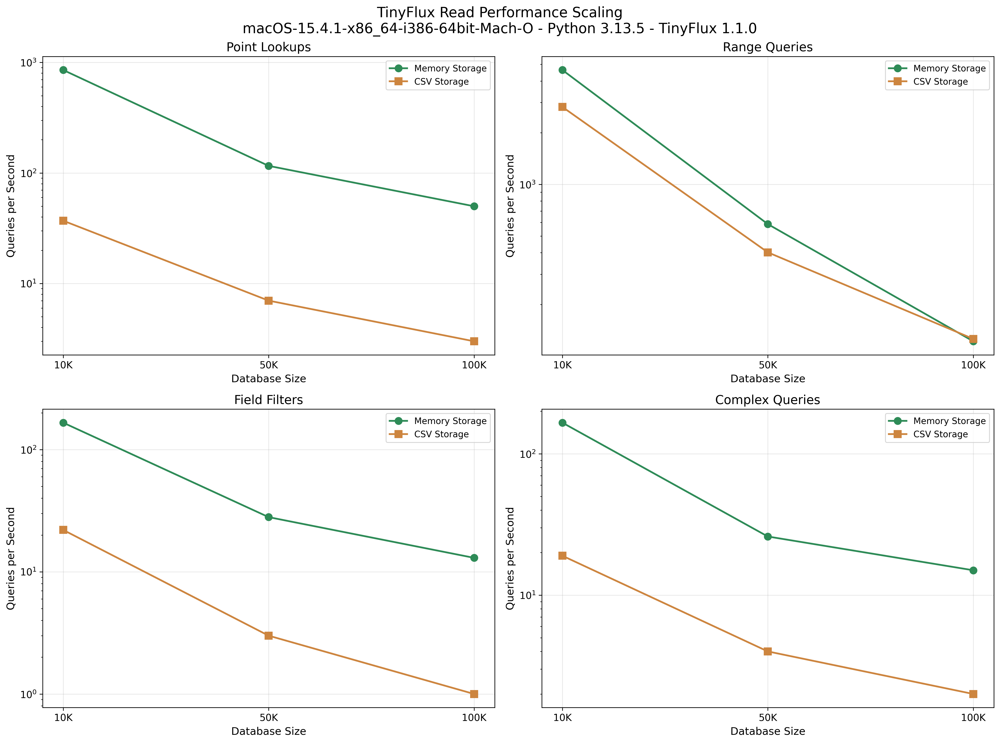

<p align="center">
  
  
</p>

TinyFlux is the tiny time series database optimized for your happiness 😎

TinyFlux is the time series version of [TinyDB](https://tinydb.readthedocs.io/en/latest/index.html) that is written in Python and has no external dependencies. It consistently writes atomically to file at over 6,000 writes per second and supports greater than 100 queries per second for time-based range queries on datasets up to 100,000 points. It's a perfect companion for small analytics workflows and apps, as well as at-home IOT data stores. TinyFlux has 100% test coverage, over 120,000 downloads, and no open issues.

[](https://tinyflux.readthedocs.io/en/latest/?badge=latest)
[](https://pypi.org/project/tinyflux/)
[](https://pypi.org/project/tinyflux/)
[](https://codecov.io/gh/citrusvanilla/tinyflux)
[](https://github.com/citrusvanilla/tinyflux/actions)

## Quick Links

- **Documentation**: [tinyflux.readthedocs.io](https://tinyflux.readthedocs.io/)
- **Repository**: [github.com/citrusvanilla/tinyflux](https://github.com/citrusvanilla/tinyflux)
- **PyPI**: [pypi.org/project/tinyflux](https://pypi.org/project/tinyflux/)

## Installation

Install from PyPI:

```bash
pip install tinyflux
```

## Quick Start

```python
from datetime import datetime, timezone
from tinyflux import TinyFlux, Point

# Create database
db = TinyFlux('sensor_data.csv')

# Insert a data point
point = Point(
    time=datetime.now(timezone.utc),
    measurement='temperature', 
    tags={'sensor': 'living_room', 'unit': 'celsius'},
    fields={'value': 23.2}
)
db.insert(point)

# Query recent data
from tinyflux.queries import TimeQuery
recent_data = db.search(TimeQuery() >= datetime.now(timezone.utc).replace(hour=0))
print(f"Today's readings: {len(recent_data)}")
```

## Why TinyFlux?

**🚀 Simple**: Clean, intuitive API inspired by TinyDB  
**📈 Fast**: Optimized for time series workloads with automatic indexing  
**💾 Flexible**: Memory or file-based storage with human-readable CSV format  
**🔍 Powerful**: Rich query system with time-range, tag, and field filtering  
**🪶 Lightweight**: Zero external dependencies, pure Python  

## Core Concepts

- **Point**: A single time series record with timestamp, measurement, tags, and fields
- **Measurement**: Logical grouping of related points (like a table)
- **Tags**: Indexed metadata for grouping and filtering (strings only) 
- **Fields**: Actual time series values (numbers, strings, booleans)
- **Queries**: Flexible filtering system for retrieving data

## Performance

TinyFlux delivers high-performance time series operations across database sizes. Benchmarks conducted on **macOS 15.4.1** with **Intel i5 (6 cores), 32GB RAM, Python 3.13.5**.

### Key Performance Metrics

| Database Size | Writes (Memory) | Writes (CSV) | Range (Memory) | Range (CSV) | Lookup (Memory) | Lookup (CSV) |
|---------------|-----------------|--------------|----------------|-------------|-----------------|--------------|
|               | **ops/sec**     | **ops/sec**  | **QPS**        | **QPS**     | **QPS**         | **QPS**      |
| **10K points**  | 326,072         | 6,642        | 4,635          | 2,824       | 855             | 37           |
| **50K points**  | 333,242         | 6,218        | 587            | 402         | 116             | 7            |
| **100K points** | 364,261         | 6,425        | 122            | 126         | 50              | 3            |

**Query Types Explained:**

- **Range Queries**: Retrieve data within a time window (e.g., "all temperature readings from 9am-5pm"). This is the most common TSDB usage pattern.
- **Point Lookups**: Find specific records by identifier (e.g., "sensor_001's latest reading"). Less common in typical time series workflows.

**Key Insights:**

- ⚡ **Write performance is constant** regardless of database size (append-only architecture)
- 🚀 **Batch inserts** achieve 10-12x speedup over individual inserts for CSV storage  
- 📊 **Range queries** (typical TSDB usage) perform excellently: 122-4,635 QPS (Memory), 126-2,824 QPS (CSV)
- 💾 **Time series queries** scale well on both storage types, CSV even matches Memory at 100K points
- 🗃️ **Index scales efficiently**: 35MB memory for 100K points with 0.9s rebuild time

*See detailed performance analysis below for comprehensive benchmarks and visualizations.*

Run your own benchmarks: `python performance_tests/benchmark.py`

## Advanced Features

### Batch Operations
```python
# Efficient bulk inserts
points = [Point(...) for _ in range(1000)]
db.insert_multiple(points, batch_size=1000)  # 10-12x faster than individual inserts
```

### Flexible Queries
```python
from tinyflux.queries import FieldQuery, TagQuery, TimeQuery

# Range queries (most common for time series)
last_hour = db.search(TimeQuery() >= datetime.now(timezone.utc) - timedelta(hours=1))

# Tag filtering
sensor_data = db.search(TagQuery().sensor == 'living_room')

# Complex queries
hot_readings = db.search(
    (FieldQuery().temperature > 25) & 
    (TagQuery().location == 'bedroom')
)
```

### Measurements (Like Tables)
```python
# Work with specific measurements
temps = db.measurement('temperature')
temps.insert(point)
hot_days = temps.search(FieldQuery().value > 30)
```

## Storage Options

### CSV Storage (Default)
- Human-readable format
- Easy data import/export  
- Good for moderate datasets (<100K points)
- Persistent across restarts

### Memory Storage
- Ultra-fast queries (50-855 QPS)
- Perfect for high-frequency applications
- All data in RAM
- Use for temporary/cache scenarios

```python
from tinyflux.storages import MemoryStorage
db = TinyFlux(storage=MemoryStorage)
```

## Query Performance Scaling  

**Memory Storage**: Fast queries with significant degradation at scale:

- Point lookups: 855 → 50 QPS (10K → 100K points)  
- Range queries: 4,635 → 122 QPS (10K → 100K points)
- Index performance degrades with dataset size despite 100% coverage

**CSV Storage**: Linear scan performance severely impacted by size:

- Point lookups: 37 → 3 QPS (10K → 100K points)
- All query types degrade significantly at 100K+ points (full file scans)
- Range queries benefit from early termination: 2,824 → 126 QPS

## Performance Visualizations


<p align="center"><i>Write throughput remains consistent across database sizes for both storage types.</i></p>



<p align="center"><i>Query performance degradation analysis showing Memory vs CSV storage scaling.</i></p>


<p align="center"><i>Comprehensive performance insights including speedup ratios and key metrics.</i></p>

## Index Performance

TinyFlux automatic indexing provides:

- **Linear memory scaling**: ~3-3.5 MB per 10K points (varies by storage type)
- **Rebuild performance**: 0.23s (Memory) to 0.88s (CSV) for 100K points
- **100% coverage**: All points indexed for optimal query performance
- **Automatic maintenance**: Index updates during batch operations

## Optimization Recommendations

**For Maximum Write Throughput:**
- Use Memory storage for fastest writes (326K-364K individual, 1.2M-1.4M batch writes/sec)
- Prefer `insert_multiple()` for bulk operations (10-12x speedup for CSV)
- Use batch sizes of 1,000 for optimal memory/performance balance

**For Persistent Storage:**
- CSV storage provides human-readable persistence
- Batch operations critical for CSV performance (10-12x speedup)
- Consider write-heavy vs read-heavy workload patterns

**For Query Performance:**
- Range queries (typical TSDB usage) perform well on both storage types (122-4,635 QPS)
- Index-friendly query patterns (time ranges, specific tag lookups)
- Consider data partitioning for very large datasets (>100K points)

## TinyFlux Across the Internet

- **IoT Sensor Networks**: Collect and analyze device telemetry
- **System Monitoring**: Track server metrics and application performance  
- **Financial Data**: Store and query stock prices, trading volumes
- **Scientific Research**: Log experimental measurements and observations
- **Web Analytics**: Time-stamped user interaction data

*Perfect for prototyping, edge computing, embedded systems, and applications where simplicity matters.*

## Contributing

We welcome contributions! Please see our [Contributing Guidelines](CONTRIBUTING.md) for details.

## License

MIT License. See [LICENSE](LICENSE) file for details.

## Changelog

See [CHANGELOG.rst](docs/source/changelog.rst) for version history and updates.
